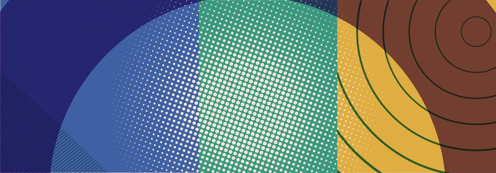
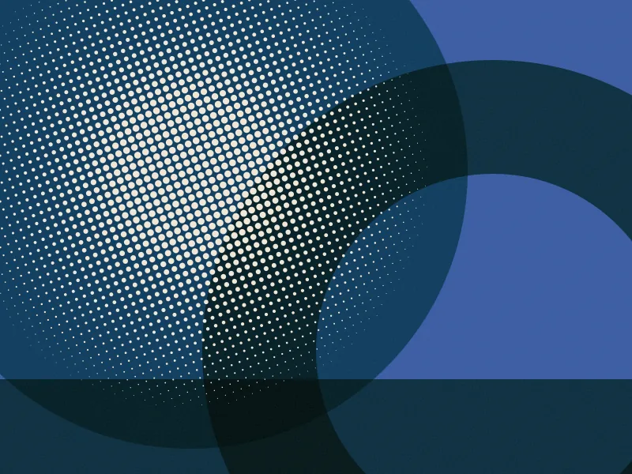
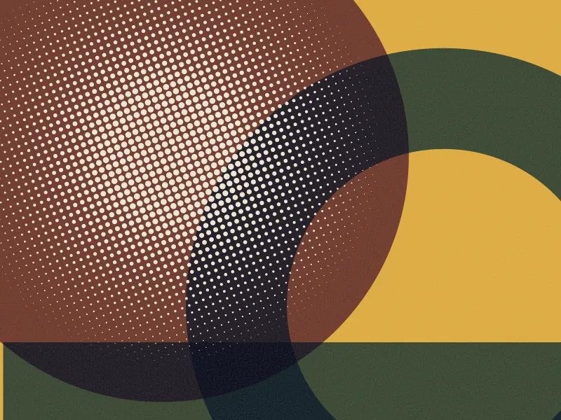
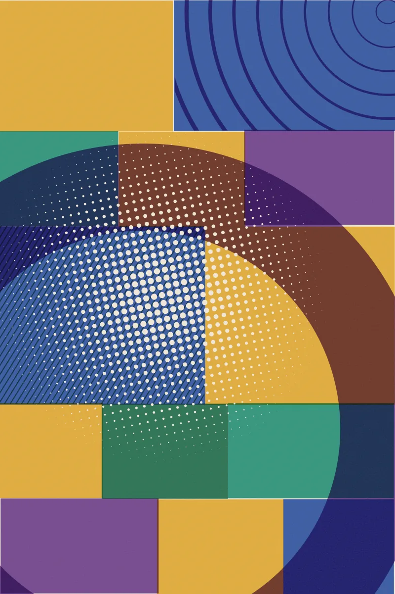
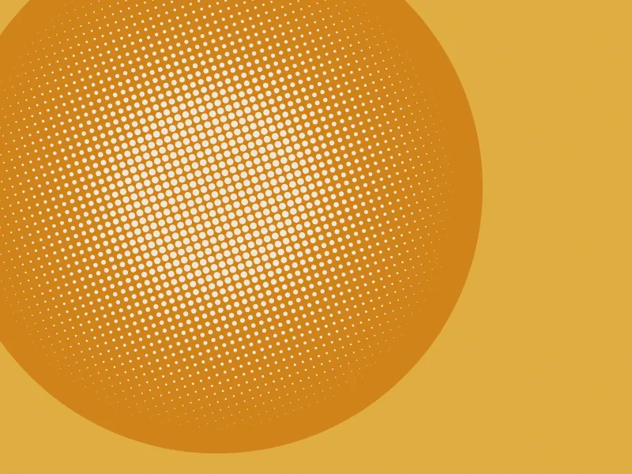
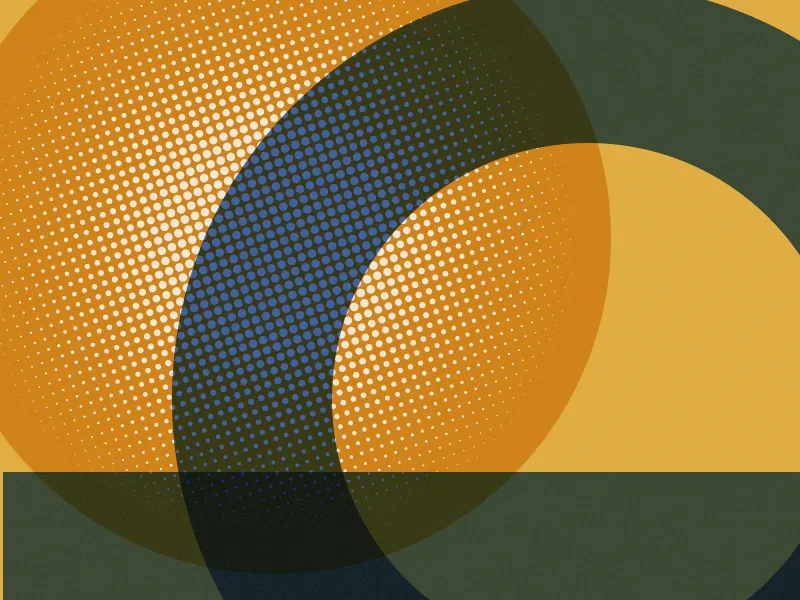
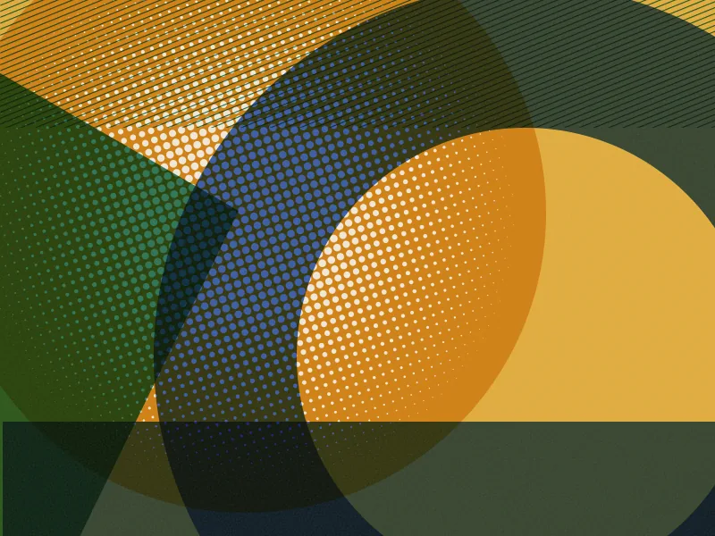
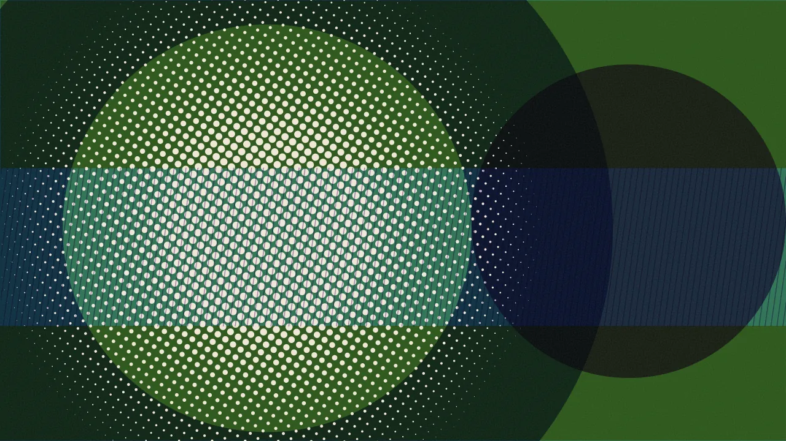

Six evenings at a letterpress shop, learning to set type by hand. I kept notes because I could not keep up, and the notes turned out to be the interesting part.

<figure>

<figcaption>The shop at seven in the evening, before anyone else arrives. Machine oil and wet paper, a smell that gets into your coat and stays there for a week.</figcaption>
</figure>

## Monday — the stick

You hold a composing stick in your left hand and build the line letter by letter with your right. It is a small metal tray with one adjustable end, and you set it to the width of your line — thirty picas, in my case, which is five inches — and then you do not change it again for the rest of the job.

The first thing nobody tells you is how heavy type is. A line of thirty picas in twelve point is a surprising weight in the palm, and by the fourth line the stick is a real object and your wrist knows it. People did this for ten hours a day for four hundred years.

The second thing is that you are building the line **backwards and upside down**. Not one or the other. Both.

```gallery


```

Metal on the left of your brain, paper on the right. There is a moment on the first evening where those two stop being different things, and after that you read the stick as fast as you read the page, and you cannot explain to anyone how it happened.

Every piece of type has a groove cut across one face, called the nick. It faces you when the letter is the right way up. You stop looking at the letters within about twenty minutes and start reading the nicks, which is a bit like learning to touch-type: the thing you thought was the skill turns out to be the scaffolding you throw away.

## Tuesday — the case

Type lives in a shallow drawer divided into compartments, and the compartments are not alphabetical. They are arranged by how often you reach for them. `e` gets a compartment the size of your fist. `z` and `q` and `x` are exiled to the far corner in boxes you could not fit a stamp in.

<figure>

<figcaption>The California job case is a frequency table of English rendered as furniture — somebody worked the proportions out empirically and nobody has needed to revise them since.</figcaption>
</figure>

Capitals were historically kept in a separate case, set on the rack above the one with the small letters. Upper case. Lower case. Every time you have ever typed those words you were describing a piece of furniture.

The compartments for `p`, `q`, `b` and `d` sit apart from each other, which is sensible, because at the size you are reading them and mirrored on the metal, they are the same letter four times. Whether that is where "mind your p's and q's" comes from is one of those etymologies everyone in a print shop will tell you and no dictionary will confirm.

## Wednesday — the spaces are the job

I had assumed the letters were the work and the gaps were the absence of work. It is closer to the reverse.

Every space between words is a physical object you select and place. They come in a graded set:

- **Quads** — the big ones, used at line ends and for indents.
  - An em quad is a square of the body size. Printers call it a mutton.
  - An en quad is half that. A nut. The names exist so that "em" and "en" cannot be misheard across a noisy shop.
- **Spaces** — the working gaps between words.
  - Three-to-em, four-to-em, five-to-em, thinnest last.
  - You choose per gap, not per line.

And then the line has to be *exactly* the width of the stick. Not close. Exactly. A line that is loose will not lock up, and when you lift the form the letters fall out of it onto the floor, which happened to me on Thursday.

So you go back along a finished line, pulling four-to-ems out and putting five-to-ems in, gap by gap, until it wedges. That is called justification, and it is where the word comes from, and it is a manual optimisation problem you solve nine times a paragraph.

The first thing I understood that I did not expect: **a justified line in a book is not a typographic style. It is a structural requirement.** Ragged-right in metal type would mean a line that does not lock and cannot be printed. Every justified column of text you have ever read is a fossil of that constraint, carried forward into software that has not needed it since about 1985.

## Thursday — the first pull

Lines go from the stick to a galley, a three-sided metal tray. When there is enough for a page, the block of type — the form — gets moved onto the press bed and surrounded with furniture, which is wooden and metal blocking, and squeezed tight with expanding wedges called quoins. Then you tap the whole surface flat with a block of wood and you lift the corner of the chase very slightly to see if anything shifts.

Something shifted. Two lines of type went onto the floor in the order they had not been set in.

The second attempt held. You roll ink out on a slab until it makes a specific sticky hiss that I could not reproduce and my teacher could hear from across the room, charge the roller, run it over the form, lay a sheet down, and pull.

```gallery



```

Three pulls, about forty minutes apart. The first came off starved — the rollers had not charged and half the letters printed grey and patchy. The second took more ink and most of the line came up. The third is right. The whole difference is how much ink sits on the roller and how flat the form is lying, and both of those are judged by hand and eye with no number attached to either.

The third one is the first thing I have made in years that exists in exactly one place.

## Friday — the mistake

I set a forty-word passage with one wrong letter in it: an `n` where an `h` should have been, in the second line of the second paragraph.

In software this is a keystroke. Here it is: unlock the quoins, lift the furniture, get the line out of the form without disturbing the ones above and below it, find the wrong sort with tweezers, replace it, re-justify the line because the two letters are not the same width, put it back, re-lock, re-flatten, re-ink, re-pull. Twenty-five minutes.

<figure>

<figcaption>A still cannot carry the sound of the press, and the sound is most of it — a long mechanical breath, a pause, then paper.</figcaption>
</figure>

I have thought about that twenty-five minutes a lot since. Not as a lesson about care — the obvious moral, and I do not think it is true. Proofreaders existed because typesetters made errors constantly; the cost of the error did not prevent the error, it just moved who caught it and when.

What it changed was something smaller. When the cost of a change is twenty-five minutes, you finish composing the sentence in your head before you reach for the first letter. Not because you are being careful. Because starting is expensive, and your brain quietly reorganises around that fact without asking you.

## Saturday — distribution

The last job is taking it apart. Every piece of type goes back into its own compartment in the case, by hand, one at a time. It is called distribution, and it takes about as long as setting did.

Nothing is kept. The thing you made exists only as the sheets you pulled, and the type is a raw material again by Monday.

I asked whether anyone ever leaves a form standing. Sometimes, for a reprint, if there is a spare chase and nobody needs the letters. Mostly not — you cannot afford to have half your `e`s locked up in something you finished.

Which is, when you look at it directly, a font cache with an eviction policy, worked out in the fifteenth century, enforced by the physical scarcity of the letter `e`.

---

Six evenings, one page, about six hundred words of finished text. If I had typed it, it would have taken four minutes and I would not remember a sentence of it.

I can still recite the second paragraph.
